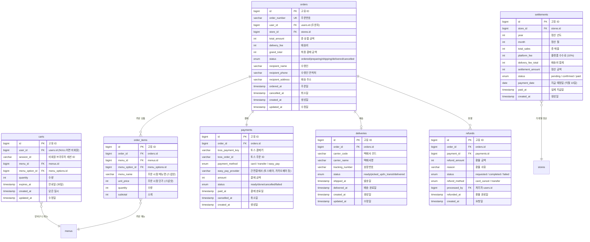

```mermaid
erDiagram
    carts {
        bigint id PK "고유 ID"
        bigint user_id FK "users.id (NULL이면 비회원)"
        varchar session_id "비회원 브라우저 세션 ID"
        bigint menu_id FK "menus.id"
        bigint menu_option_id FK "menu_options.id"
        int quantity "수량"
        timestamp expires_at "만료일 (30일)"
        timestamp created_at "담은 일시"
        timestamp updated_at "수정일"
    }

    orders {
        bigint id PK "고유 ID"
        varchar order_number UK "주문번호"
        bigint user_id FK "users.id (주문자)"
        bigint store_id FK "stores.id"
        int total_amount "총 상품 금액"
        int delivery_fee "배송비"
        int grand_total "최종 결제 금액"
        enum status "ordered/preparing/shipping/delivered/cancelled"
        varchar recipient_name "수령인"
        varchar recipient_phone "수령인 연락처"
        varchar recipient_address "배송 주소"
        timestamp ordered_at "주문일"
        timestamp cancelled_at "취소일"
        timestamp created_at "생성일"
        timestamp updated_at "수정일"
    }

    order_items {
        bigint id PK "고유 ID"
        bigint order_id FK "orders.id"
        bigint menu_id FK "menus.id"
        bigint menu_option_id FK "menu_options.id"
        varchar menu_name "주문 시점 메뉴명 (스냅샷)"
        int unit_price "주문 시점 단가 (스냅샷)"
        int quantity "수량"
        int subtotal "소계"
    }

    payments {
        bigint id PK "고유 ID"
        bigint order_id FK "orders.id"
        varchar toss_payment_key "토스 결제키"
        varchar toss_order_id "토스 주문 ID"
        enum payment_method "card / transfer / easy_pay"
        varchar easy_pay_provider "간편결제사 (토스페이, 카카오페이 등)"
        int amount "결제 금액"
        enum status "ready/done/cancelled/failed"
        timestamp paid_at "결제 완료일"
        timestamp cancelled_at "취소일"
        timestamp created_at "생성일"
    }

    deliveries {
        bigint id PK "고유 ID"
        bigint order_id FK "orders.id"
        varchar carrier_code "택배사 코드"
        varchar carrier_name "택배사명"
        varchar tracking_number "송장번호"
        enum status "ready/picked_up/in_transit/delivered"
        timestamp shipped_at "발송일"
        timestamp delivered_at "배송 완료일"
        timestamp created_at "생성일"
        timestamp updated_at "수정일"
    }

    settlements {
        bigint id PK "고유 ID"
        bigint store_id FK "stores.id"
        int year "정산 년도"
        int month "정산 월"
        int total_sales "총 매출"
        int platform_fee "플랫폼 수수료 (10%)"
        int delivery_fee_total "배송비 합계"
        int settlement_amount "정산 금액"
        enum status "pending / confirmed / paid"
        date payment_date "지급 예정일 (익월 10일)"
        timestamp paid_at "실제 지급일"
        timestamp created_at "생성일"
    }

    refunds {
        bigint id PK "고유 ID"
        bigint order_id FK "orders.id"
        bigint payment_id FK "payments.id"
        int refund_amount "환불 금액"
        varchar reason "환불 사유"
        enum status "requested / completed / failed"
        enum refund_method "card_cancel / transfer"
        bigint processed_by FK "처리자 users.id"
        timestamp refunded_at "환불 완료일"
        timestamp created_at "요청일"
    }

    orders ||--o{ order_items : "주문 상품"
    orders ||--|| payments : "결제"
    orders ||--o| deliveries : "배송"
    orders ||--o{ refunds : "환불"
    carts }o--|| menus : "장바구니 메뉴"
    order_items }o--|| menus : "주문 메뉴"
    settlements }o--|| stores : "가게별 정산"
```